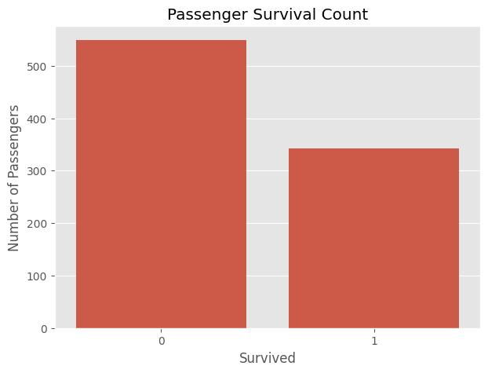
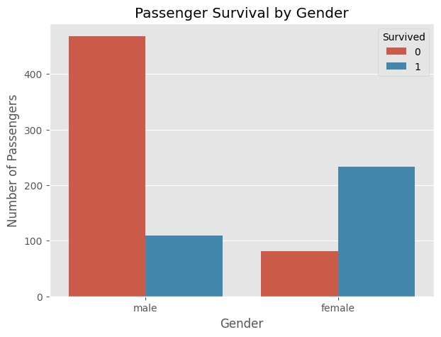
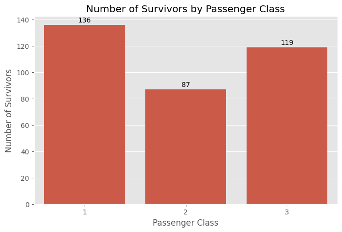
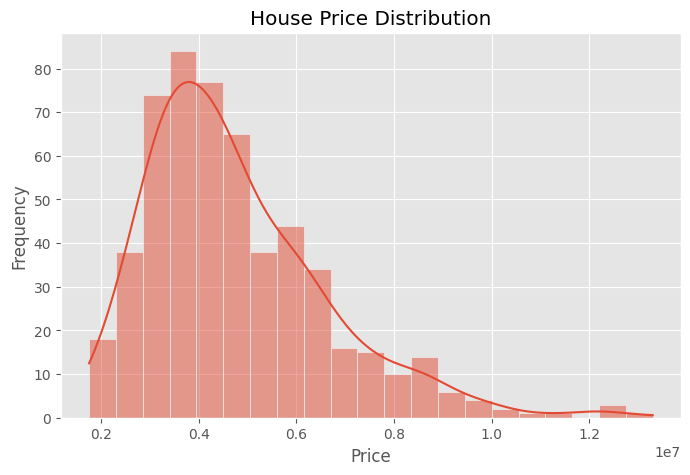
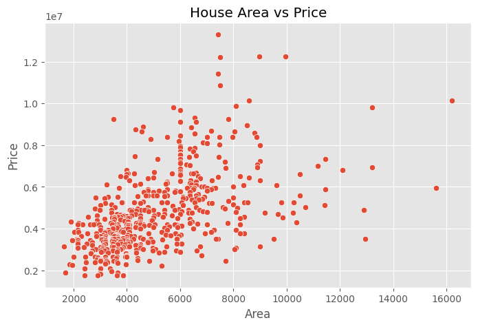
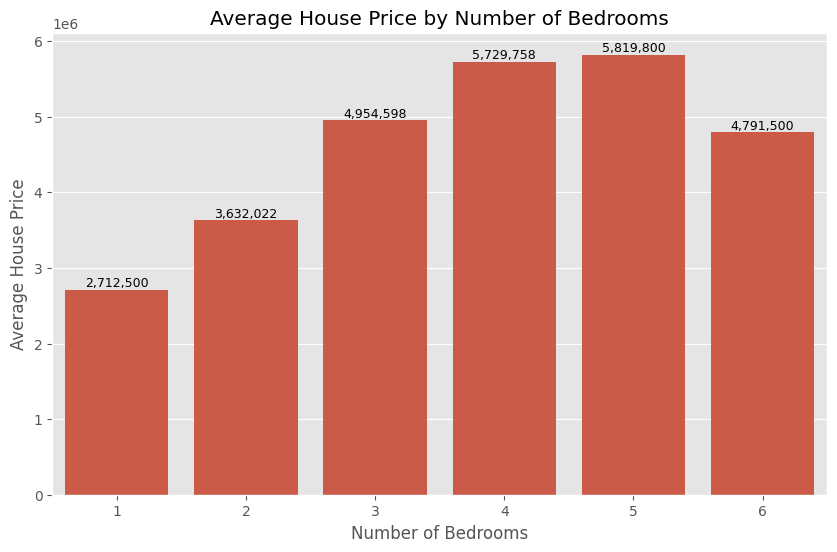

# Week 1&2 Technical Report
## Data Cleaning and Exploratory Data Analysis (EDA)
## AnalystLab Africa Data Science Internship

**Prepared by:** Eyethu Njemla

**Internship:** AnalystLab Africa Data Science Internship

**Tools Used:** Python, Pandas, NumPy, Matplotlib, Seaborn, Jupyter Notebook, Visual Studio Code

**Report Date:** 14 July 2026

## Table of contents
1.Introduction

2.Project Objectives

3.Dataset Description

4.Methodology

5.Data Quality Assessment

6.Data Cleaning

7.Exploratory Data Analysis

8.Key Findings

9.Recommendations

10.Conclusion
References

# 1. Introduction
Data preparation is one of the most important stages of the data science process. Before meaningful analysis or machine learning can be performed, datasets must first be examined, cleaned, and understood. Real-world data often contains missing values, duplicate records, inconsistent formatting, and other quality issues that can affect the accuracy and reliability of analytical results.

This report documents the activities completed during Weeks 1 and 2 of the AnalystLab Africa Data Science Internship. The project focused on two publicly available datasets: the Titanic dataset and the Housing dataset. The main objective was to assess data quality, clean the datasets, perform exploratory data analysis (EDA), and identify meaningful patterns that can support future predictive modelling tasks.

Exploratory Data Analysis allows data scientists to understand the characteristics of a dataset before building machine learning models. Through descriptive statistics and data visualisations, EDA helps uncover trends, relationships, and anomalies while providing valuable insights into the underlying data.

# Project objectives
The objectives of this project were to:

-Load the Titanic and Housing datasets into Python.

-Explore the structure and characteristics of both datasets.

-Identify missing values and duplicate records.

-Clean the datasets using appropriate preprocessing techniques.

-Generate descriptive statistics.
Create informative visualisations.

-Analyse relationships between important variables.

-Prepare the datasets for future machine learning tasks.

# 3. Dataset Description
## 3.1 Titanic Dataset
The Titanic dataset contains passenger information collected from the RMS Titanic disaster. The dataset is widely used in data science because it provides an excellent example of a binary classification problem.

Important variables include:
| Feature  | Description                       |
| -------- | --------------------------------- |
| Survived | Passenger survival status         |
| Pclass   | Passenger ticket class            |
| Sex      | Passenger gender                  |
| Age      | Passenger age                     |
| SibSp    | Number of siblings/spouses aboard |
| Parch    | Number of parents/children aboard |
| Fare     | Passenger fare                    |
| Embarked | Port of embarkation               |

## 3.2 Housing Dataset
The Housing dataset contains information describing residential properties and their selling prices.

Key variables include:
| Feature         | Description                      |
| --------------- | -------------------------------- |
| Price           | Selling price                    |
| Area            | Total house area                 |
| Bedrooms        | Number of bedrooms               |
| Bathrooms       | Number of bathrooms              |
| Stories         | Number of floors                 |
| Parking         | Parking spaces                   |
| Airconditioning | Availability of air conditioning |
| Prefarea        | Preferred residential area       |

# 4. Methodology

## 4.1 Data Loading
Both datasets were imported using the Pandas library. Initial exploration was conducted using functions such as:

-head()

-shape()

-info()

-describe()

These functions provided an overview of the datasets' dimensions, data types, and statistical properties. 

## 4.2 Data Quality Assessment
The datasets were assessed to identify common data quality issues.

The following analyses were performed:

-Missing value 
-analysis

-Duplicate record detection

-Data type inspection

-Unique value analysis

## 4.3 Data Cleaning

Data cleaning involved improving the quality of each dataset before analysis.

**Titanic Dataset**

The following preprocessing steps were completed:

Removed duplicate records.
Replaced missing values in the Age column using the median.
Replaced missing values in the Embarked column using the mode.
Removed the Cabin column due to the high proportion of missing values.

**Housing Dataset**

The following preprocessing steps were completed:

Removed duplicate records.
Replaced missing numerical values using the median.
Replaced missing categorical values using the mode.

The cleaned datasets were saved for future analysis.

## 4.4 Exploratory Data Analysis
Exploratory data analysis was conducted to understand the characteristics of each dataset through visualisation.

**Titanic Visualisations**

The following visualisations were created:

Passenger survival count
Survival by gender
Age distribution
Survivor distribution by passenger class (pie chart)
Correlation heatmap

**Housing Visualisations**

The following visualisations were created:

House price distribution
Area versus selling price
Relationship between selling price and number of bedrooms
Correlation heatmap 

# 6. Exploratory Data Analysis
EDA provided insight into the structure and relationships within both datasets.

**Titanic Dataset** 

The analysis revealed that:

Female passengers experienced higher survival rates than males.
Passenger class influenced survival outcomes.
Higher ticket fares were generally associated with increased survival rates.

**Figure 1:** Passenger Survival Count

**Figure 2:** Passenger Survival by Gender

**Figure 3:** Distribution of Survivors by Passenger Class

**Housing Dataset**

Several interesting relationships were identified.

The scatter plot demonstrated that larger houses generally sold at higher prices.

The box plot comparing house prices against the number of bedrooms indicated that properties with more bedrooms tended to have higher selling prices. However, considerable variation existed within each bedroom category, suggesting that additional variables such as area, location, and number of bathrooms also contribute to pricing.

The correlation heatmap showed strong positive relationships between selling price and several numerical variables, particularly property area.

**Figure 4:** House Price Distribution

**Figure 5:** Area versus House Price

**Figure 6:** House Price by Number of Bedrooms

# 9. Conclusion

This project successfully demonstrated the importance of data cleaning and exploratory data analysis as foundational stages of the data science process.

The datasets were systematically assessed for quality issues, cleaned using appropriate preprocessing techniques, and explored through statistical summaries and visualisations. The analysis identified several meaningful relationships that will support future predictive modelling activities during the internship.

Completing this project strengthened practical skills in Python programming, data preprocessing, exploratory analysis, visualisation, and technical reporting. The cleaned datasets are now well prepared for the next phase of the internship, which will focus on statistical analysis and machine learning.